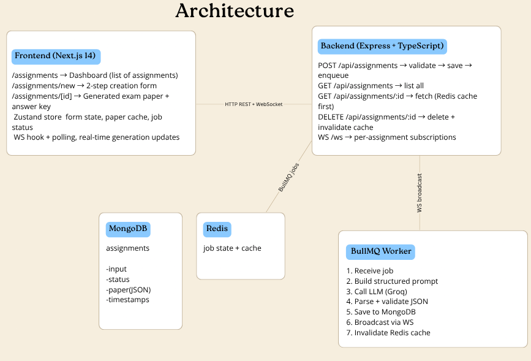
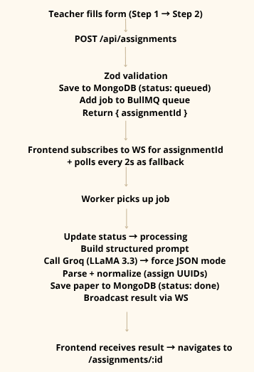

# VedaAI – AI Assessment Creator

 Full-stack AI-powered question paper generator for teachers.  
 Built for the VedaAI Full Stack Engineer hiring assignment.

---

## Live Architecture


---

## Flow



## Tech Stack

| Layer | Tech |
|-------|------|
| Frontend | Next.js 14 (App Router), TypeScript, Zustand, WebSocket |
| Backend | Node.js, Express, TypeScript |
| Database | MongoDB (Mongoose) |
| Queue | BullMQ + Redis |
| AI | Anthropic Claude (claude-sonnet-4) |
| Styling | CSS-in-JS (styled-jsx), Tailwind utility classes |

---

## Setup

### Prerequisites
- Node.js 18+
- MongoDB running locally (`mongodb://localhost:27017`)
- Redis running locally (`redis://localhost:6379`)
- Anthropic API key

### 1. Clone & install

```bash
git clone <repo-url>
cd vedaai-assessment

# Backend
cd backend && npm install
cp .env.example .env
# Fill in ANTHROPIC_API_KEY in .env

# Frontend
cd ../frontend && npm install
cp .env.local.example .env.local
```

### 2. Start services

```bash
# Terminal 1 – Backend API server
cd backend && npm run dev

# Terminal 2 – BullMQ Worker (separate process)
cd backend && npm run worker

# Terminal 3 – Frontend
cd frontend && npm run dev
```

Open [http://localhost:3000](http://localhost:3000)

### Docker (optional)

```bash
docker-compose up -d  # starts MongoDB + Redis
```

---

## Key Design Decisions

### Prompt → Structured JSON
The LLM is prompted to return **only valid JSON** matching a strict schema. The response is stripped of any markdown fences, parsed, and normalized with UUIDs before storage. The frontend never renders raw AI text.

### Separation of API server and Worker
The Express server and BullMQ worker run as separate Node processes. This means:
- API stays responsive even during slow LLM calls
- Workers can be horizontally scaled independently
- Failed jobs are retried with exponential backoff

### Redis caching
Completed assignments are cached in Redis for 1 hour. Repeated `GET /api/assignments/:id` calls (e.g. page refresh) are served from cache without hitting MongoDB or re-running the LLM.

### WebSocket per assignment
Clients subscribe using `{ type: 'subscribe', assignmentId }`. The WS manager maintains a `Map<assignmentId, Set<WebSocket>>` so multiple tabs/devices can receive the same assignment's updates.

### Form validation
All validation is done client-side before submission (empty fields, negative numbers, at least one question type). Zod validates again server-side as a second layer.
